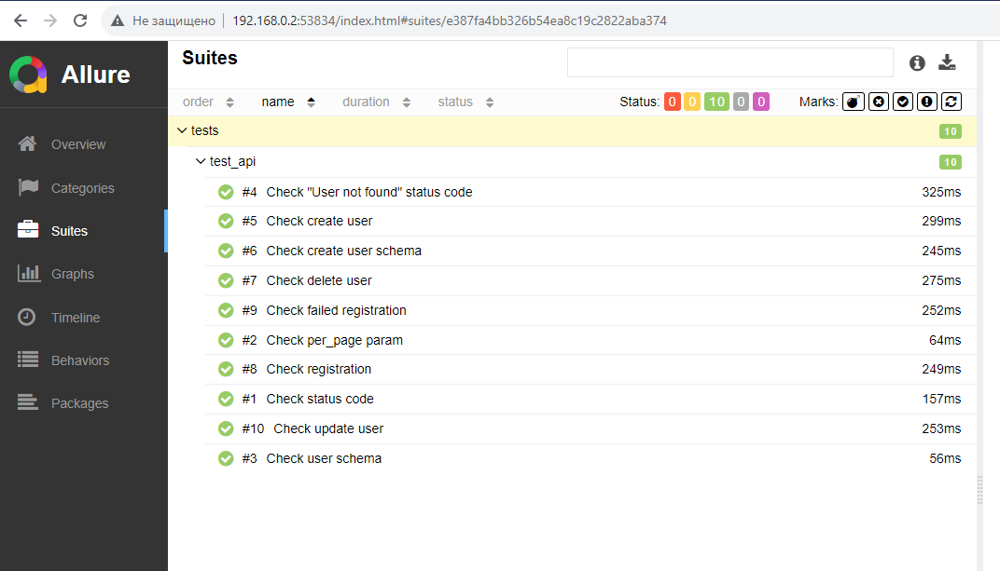

# ## Проект API автотестов для демо-сайта https://reqres.in/


### Содержит следующие API тесты:
    1.Тест статус кода ответа
    2.Тест ответа с параметром per_page
    3.Тест валидации user schema
    4.Тест статус кода ответа "User not found"
    5.Тест создания пользователя
    6.Тест валидации user schema при создании пользователя
    7.Тест статус кода при удалении юзера
    8.Тест регистрации пользователя
    9.Тест ошибки при регистрации пользователя
    10.Тест изменения данных пользователя

## Запуск тестов
### Для локального запуска
1. Склонируйте репозиторий
2. Откройте проект в PyCharm
3. Введите в териминале команду
``` 
python -m venv .venv
source .venv/bin/activate
pip install -r requirements.txt
pytest .
```

###  [Запуск проекта в Jenkins]()


###  Отчет о прохождении тестов в [Allure report](https://jenkins.autotests.cloud/job/UI_part/11/allure/#)


###  Оповещение о прохождении тестов c кратким отчетом Telegram


